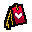
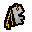
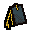
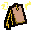
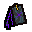

# Teleport with Bookmarks

Setup teleports with new trinkets!  Ease your travel while holding a bookmark, which lets you jump between specific rooms on a given floor.  This mod will also let you teleport between any boss/arena room, without holding an item, with an Mod Config option tweak... 

There are up to 7 trinkets to discover, each with unique properties.

 
 
 
 
 
 
 

When holding a bookmark, you are given the following effects:

1. After teleporting with any valid teleporting item, you will be able to return to exactly where you arrived with the Card/Pill key, as the Go Back function.

2. While holding the trinket in a valid room, you can teleport between every other valid room and the starting room, as long as it has been discovered and cleared.  The rooms available are cumulative to all bookmarks you are currently holding.  Refer to the table below.

3. As a bonus, when holding a valid bookmark and using a valid Book active or Book effect, there is a small chance to spawn a pickup corresponding to that item.

Trinket | Name | Rooms | Droptype
------ |------ | ------ | ------
 | Blank Bookmark | [special]
 | Gilded Bookmark | Shop, Arcade, Dice | Coin
 | Pretty Bookmark| Curse, Sacrifice | Heart
 | Dusty Bookmark| Secret, Super Secret, Ultra Secret, Bedroom | Key
 | Charred Bookmark| Boss, Miniboss, Arena, Boss Arena | Bomb
 | Copper Bookmark | Treasure, Chest, Library | Battery
 | Cosmic Bookmark | [special]

Blank and Cosmic bookmarks have special properties associated with them:

* A Blank bookmark can be dropped in any valid room, and will be instantly transformed into a bookmark on the chart above.  This can be used to get a preferred teleport method to your liking.

  Blank bookmarks can also be randomly found when picking up a brand new Book active or passive item, which makes them likely to appear in libraries.

* A Cosmic bookmark does not teleport you to any place, but has the powerful ability of a Glowing Hour Glass after teleporting with any valid teleport item.

With the Mod Config (or notepad editor), you can active the following:

* Always Boss Bookmark:

  If this option is True, the player will always have the ability to jump between Boss rooms, Miniboss rooms, Arenas and the starting room, as long as they've been discovered and cleared.

* Reroll All Bookmarks:

  If this option is True, any bookmark that is dropped in a valid room will become that type of bookmark.  If this is False, only Blank bookmarks will ever be transformed.

TODO:

* Bugtesting hasn't been totally complete

* No testing with Dice Bag, which likely will cause potential issues?
